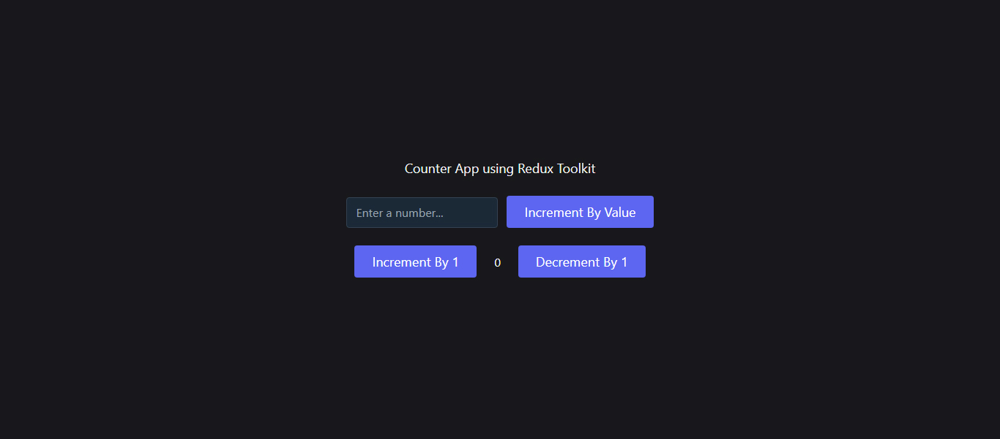

# Redux Counter App

A simple counter application built with **React** and **Redux Toolkit**. It demonstrates basic state management using Redux, including increment, decrement, and increment by value functionality.

## 🚀 Live Demo

Check out the live version here: [redux-counter-app-pi.vercel.app](https://redux-counter-app-pi.vercel.app/)   

---

## 🛠️ Tech Stack

- React
- Redux Toolkit
- JavaScript
- CSS (or Tailwind/Bootstrap if used)
- Vite / Create React App *(mention what you used)*

---

## 📸 Screenshots



---

## 📦 Installation

Follow these steps to run the project locally:

1. **Clone the repository**

```bash
git clone https://github.com/your-username/redux-counter-app.git
```
2. **Navigate to Project folder**
```bash
cd redux-counter-app
```

3. **Install Dependencies**
```bash
npm install
```

4. **Start the development Server **
```bash
npm run start
or
npm start
```
## 🧠 Learning Purpose

This project was created as part of my learning journey with React and Redux Toolkit. It helps understand core Redux concepts such as:

Store

Slice

Actions and reducers

Connecting Redux with React components
